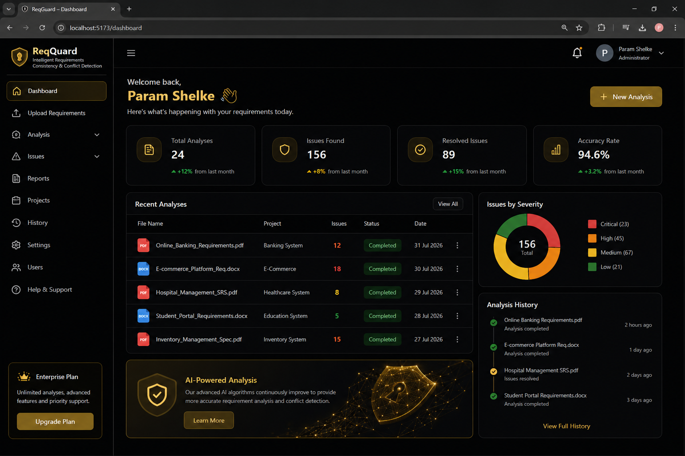

<div align="center">

  

  # ReqGuard

  ### Intelligent requirements. Fewer conflicts. Better software.

  ReqGuard is an AI-powered requirement engineering workspace for extracting, reviewing, and improving software requirements before implementation begins.

  <p>
    <a href="#-overview">Overview</a> ·
    <a href="#-capabilities">Capabilities</a> ·
    <a href="#-getting-started">Getting started</a> ·
    <a href="#-project-structure">Project structure</a>
  </p>

  <p>
    
    
    
    
    
  </p>

</div>

<br />

<div align="center">
  
</div>

## ✦ Overview

Requirement documents often hide contradictions, duplicated intent, vague language, and inconsistent terminology until those problems become expensive implementation rework. ReqGuard adds a review layer between document intake and development.

The platform accepts requirement sets, extracts requirement statements, analyzes relationships and quality signals, and turns the results into actionable findings, review workflows, and shareable reports.

## ✦ Capabilities

### Requirement intelligence

- **Conflict detection** — identify requirements that describe incompatible constraints, negations, or numeric thresholds.
- **Consistency checking** — surface missing normative language and terminology drift across a requirement set.
- **Duplicate detection** — find identical and semantically similar requirements that should be consolidated.
- **Ambiguity detection** — flag vague, non-measurable wording such as “fast,” “appropriate,” or “user-friendly.”
- **Categorization and severity** — classify findings as conflict, duplicate, ambiguity, or consistency issues with low-to-critical severity and confidence scores.

### Review and collaboration

- Requirement-level findings with explanations and remediation suggestions.
- Requirement comments, review versions, approval decisions, and audit history.
- Finding status management, comments, and audit records.
- Projects, organizations, workspaces, members, invitations, roles, and activity logs.
- Search, notifications, team profile management, and support conversations.

### Reporting and operations

- Executive summaries, quality scores, severity distributions, requirement statistics, and recommendations.
- Exportable **CSV**, **PDF**, and **DOCX** reports.
- Analysis history, report snapshots, and traceable report data.
- API key management, security settings, recovery codes, sessions, and email verification.

## ✦ How it works

```text
Upload → Parse → Compare → Detect → Review → Report
```

1. **Upload** a PDF, DOCX, or structured requirement submission.
2. **Parse** the document into normalized requirement statements.
3. **Compare** related statements, subjects, terminology, and numeric constraints.
4. **Detect** conflicts, duplicates, ambiguity, and consistency issues.
5. **Review** findings collaboratively and approve or revise requirements.
6. **Report** results for engineering, product, QA, and stakeholder sign-off.

The analysis pipeline is intentionally explainable: each finding contains a type, severity, confidence, description, and suggested next step.

## ✦ Product surfaces

| Surface | Purpose |
| --- | --- |
| Landing page | Product positioning, capabilities, workflow, AI engine, pricing, testimonials, and FAQ |
| Dashboard | At-a-glance analysis metrics, recent analyses, issue severity, and activity history |
| Upload requirements | Start a new analysis from a requirement document |
| Analysis workspace | Browse analyses, requirements, findings, quality signals, and review status |
| Finding detail | Inspect a finding, related requirements, comments, and remediation guidance |
| Projects | Organize analysis work by product or system |
| Issues | Track and resolve detected requirement issues |
| Reports | Generate and download CSV, PDF, and DOCX report outputs |
| History | Review workspace activity and analysis history |
| Users and teams | Manage members, roles, invitations, and collaboration |
| Settings | Configure profile, security, sessions, API keys, and workspace preferences |
| Help & support | Search support content, contact support, and manage support tickets |

## ✦ Architecture

```text
Next.js App Router
├── Marketing experience
├── Authenticated dashboard
├── Route handlers (/api)
├── Domain services (analysis, auth, reports, support)
└── Prisma ORM
    └── Relational database
```

### Core request flow

```text
Browser
  ↓
Next.js pages and client components
  ↓
Route handlers and server actions
  ↓
Domain services
  ↓
Prisma Client → Database
```

Authentication is provided through Auth.js/NextAuth with Prisma-backed sessions and optional Google/GitHub providers. The application also includes email verification and password reset flows.

## ✦ Technology

- **Framework:** Next.js 15 App Router with React 19
- **Language:** TypeScript
- **Styling:** Tailwind CSS 4 and custom dark/gold visual system
- **Motion and UI:** Framer Motion and Lucide React
- **Data:** Prisma ORM with relational database support
- **Authentication:** Auth.js / NextAuth, Prisma adapter, bcrypt
- **Validation:** Zod and React Hook Form
- **Documents:** PDFKit and `docx` for report generation
- **Charts:** Recharts
- **Email:** Resend

## 🚀 Getting started

### Prerequisites

- Node.js 20 or newer
- npm
- A database supported by the configured Prisma datasource
- Optional OAuth credentials and Resend credentials for social login and email delivery

### Installation

```bash
git clone <your-repository-url>
cd ReqGuard
npm install
```

Create a local environment file:

```bash
copy .env.example .env.local
```

Then set at least:

```env
DATABASE_URL="your-database-connection-string"
AUTH_SECRET="replace-with-a-long-random-secret"
AUTH_URL="http://localhost:3000"
NEXT_PUBLIC_BASE_URL="http://localhost:3000"
```

Configure the optional values in `.env.example` when enabling Resend, Google OAuth, or GitHub OAuth. Never commit `.env.local` or production credentials.

### Database and development server

```bash
npx prisma generate
npx prisma migrate dev
npm run dev
```

Open [http://localhost:3000](http://localhost:3000).

### Production build

```bash
npm run build
npm run start
```

## ✦ Available scripts

| Command | Description |
| --- | --- |
| `npm run dev` | Start the Next.js development server with Turbopack |
| `npm run build` | Generate Prisma Client and create a production build |
| `npm run start` | Start the production server |
| `npx prisma generate` | Generate the Prisma Client |
| `npx prisma migrate dev` | Apply development migrations |
| `npx prisma studio` | Open the Prisma data browser |

## ✦ Project structure

```text
ReqGuard/
├── app/                  # App Router pages, layouts, and API routes
│   ├── (auth)/           # Login, signup, reset password, verification
│   ├── analysis/         # Analysis list, detail, and finding detail
│   ├── api/              # Auth, analysis, findings, reports, team, settings, support
│   ├── dashboard/        # Authenticated overview
│   ├── help/             # Support center
│   ├── history/          # Activity and analysis history
│   ├── issues/           # Issue management
│   ├── projects/         # Project management
│   ├── reports/          # Report generation and downloads
│   ├── settings/         # Account and security settings
│   ├── upload/           # Requirement upload flow
│   └── users/            # Team and user management
├── components/           # Marketing, dashboard, analysis, team, and support UI
├── lib/                  # Auth, analysis engine, reports, mail, security, and services
├── prisma/               # Schema and database migrations
├── public/               # Static icons and public assets
└── package.json          # Scripts and dependencies
```

## ✦ Data model

The Prisma schema models the complete review lifecycle, including:

- Users, accounts, sessions, organizations, workspaces, and memberships
- Projects, analyses, requirements, versions, comments, and approvals
- Findings, finding comments, and finding audits
- Reports, snapshots, activity logs, notifications, and API keys
- Support articles, feedback, tickets, conversations, and messages

## ✦ Security notes

- Keep all secrets in environment variables.
- Use a unique, high-entropy `AUTH_SECRET` in every environment.
- Restrict database access to the application runtime and rotate credentials regularly.
- Configure OAuth callback URLs and `AUTH_TRUST_HOST` deliberately for deployment.
- Review the security settings and API-key lifecycle before exposing the application publicly.

## ✦ Roadmap ideas

- Background analysis jobs for very large document sets.
- Additional document formats and richer traceability integrations.
- Configurable organization-level quality rules.
- CI/CD checks for requirement changes before merge.
- Deeper integrations with issue trackers and product delivery tools.

## ✦ License

No license has been declared yet. Add a `LICENSE` file before distributing ReqGuard outside the owning organization.

<div align="center">

  **ReqGuard — make requirements reviewable before they become rework.**

</div>
